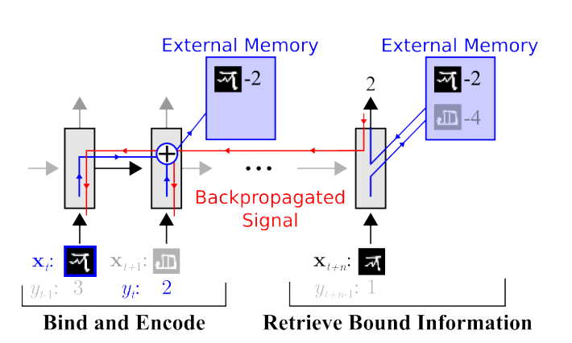

# One-shot Learning with Memory-Augmented Neural Networks 论文笔记

## 介绍

基于梯度的传统的深度学习方法需要大量的数据进行学习，当遇到新的数据，模型就不得不重新学习新的参数，而无法快速适应新的数据。

本文提出了一种记忆增强神经网络能够快速的同化新的数据，并且在学习少两样本后利用该数据做出准确的预测。

<!-- more -->

对于MANN模型的设计，作者有两个条件：

1. 存储的信息必须稳定并且是元素级的寻址。
2. 参数的数量不能束缚于存储空间的尺寸。

最终该模型能够组合以下两种优势：

1. 能够基于梯度下降的方式获取原始数据中有用的信息来学习出一种通用的的学习方式。
2. 能够基于额外的内存模块来快速的学习到从未见过信息。

## 元学习（Meta-Learning）方法设计

通常情况，都是通过在某个数据集$D$上选择参数$\theta$来最小化学习代价$\mathcal{L}$

但在元学习中，降低的是关于某个数据集分布$p(D)$的期望代价:

$$
\theta^{*}=\operatorname{argmin}_{\theta} E_{D \sim p(D)}[\mathcal{L}(D ; \theta)]
$$

为了能够实现上述目的，本文做了如下的设置：

1. 首先，采用序列输入，每个输入包含着上一个输入所对应的标签

$$
\left(\mathbf{x}_{1}, \text { null }\right),\left(\mathbf{x}_{2}, y_{1}\right), \ldots,\left(\mathbf{x}_{T}, y_{T-1}\right)
$$

2. 不同的数据集之间，标记会被打乱（防止网络逐渐学习样本和标签的映射关系），相反这使得网络学到在存储空间中保留数据样本直到下次正确的样本到来的技巧，这样就能够使得样本-标签信息绑定并且存储用于以后的使用。

元学习的模型会在不考虑数据及标签的实际内容前提下去学习绑定数据分布和对应的标签，并且会将泛化出一个通用的模型来映射数据与标签的关系用以预测。

## 记忆增强模型

### 神经图灵机（Neural Turing Machine）

神经图灵机的组成和本文的MANN大致类似。神经图灵机是由LSTM或者前馈网络这样的控制器组成，利用大量的读写heads和外置的内存模块交互。

在该模型中，控制器同样采用LSTM或者前馈网络。

To be continued