# kettle 入门教程

由于最后一个学期还有一个学分不够，就得再休一门课，看了看课表也就只能挑个OLAP了，又是一门完全陌生的课，然后网上关于kettle的教程又非常少，自己就搜罗了一些资料记录一下该课需要用的工具的笔记吧

## kettle 介绍

kettle是一个ETL（Extract, Transform and Load）数据抽取、转换、载入工具，ETL工具在数据仓库项目使用非常频繁，kettle也可以应用在以下一些场景：

- 在不同应用或数据库之间整合数据

- 把数据库中的数据导出到文本文件

- 大批量数据装载入数据库

- 数据清洗

集成应用相关项目是个使用

kettle使用非常简单，通过图形界面设计实现做什么业务，无需写代码去实现，因此,kettle是以面向元数据来设计

kettle支持很多种输入和输出格式，包括文本文件，数据表，以及商业和免费的数据库引擎。另外，kettle强大的转换功能让您非常方便操纵数据。

## kettle 安装

[下载地址](https://community.hitachivantara.com/docs/DOC-1009855)

由于我的平台是mac，有bug，双击不能运行，只能解压后 在终端输入

```bash
sh spoon.sh
```

运行spoon

## 数据转换-导出为Excel

1. 连接数据库
2. 导出为Excel
  

首先下图所示新建一个转换，并设置数据库的连接。

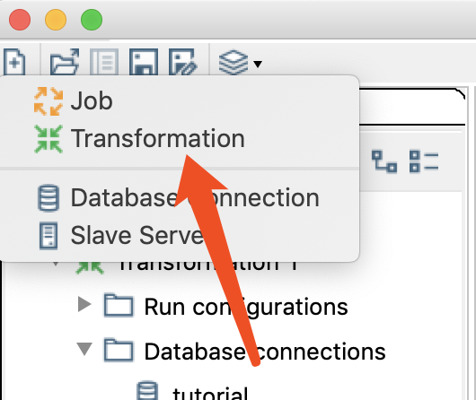

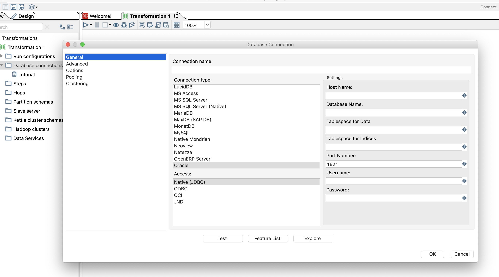

设置完数据库连接之后，就可以设置输入源，这里我们采用数据库中的table作为输入源

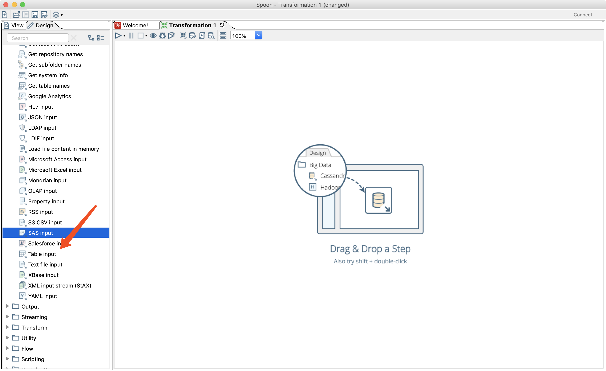

设置好输入源可以点击preview先预览数据

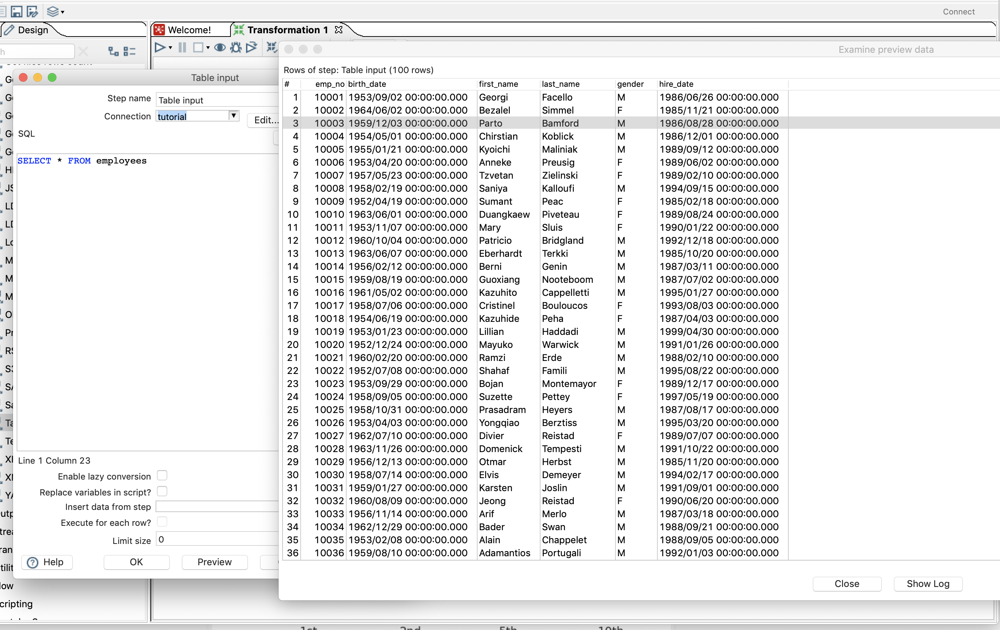

设置完输入源 同理将输出源选择excel拖到工作界面，但是先别急着配置输出源，在view栏，添加一个hop，用来连接输入和输出源

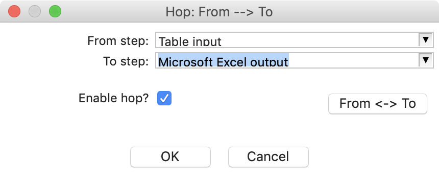

这样在配置输出源的时候，在字段的tab就可以直接获取选择要导出的字段

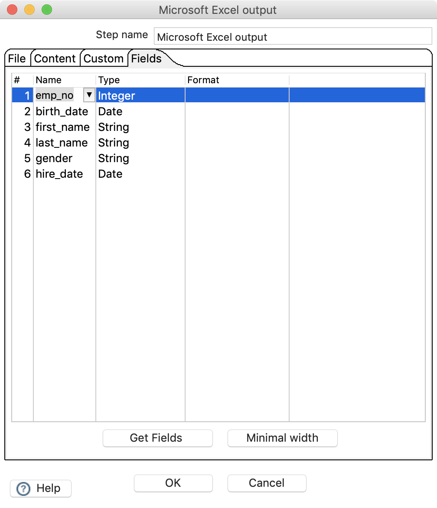

最后点击开始就进行了转换

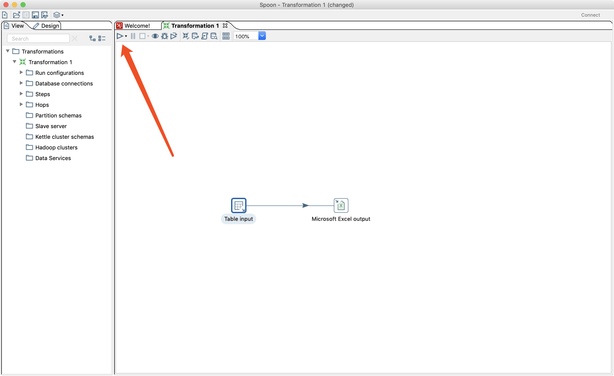

最后来看下导出的文件

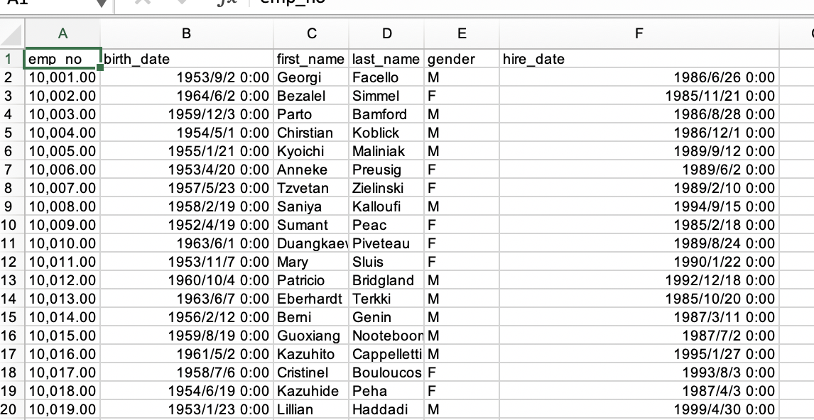

## Hello World

好，现在你已经学会了转换，下面我们就来个Helloword实例，这个教程是我在网上看到的，觉得还不错，可以多接触kettle的一些功能，而不像我上面的非常基础。

那么这个helloworld就是针对数据库中的每个人名输出对应的gretting并导出为文件。

首先同理设置输入源，但SQL语句需要修改下，我这里是只选出了他们的名字，按id排列，取前十个。

然后就是写个js脚本自动添加个hello

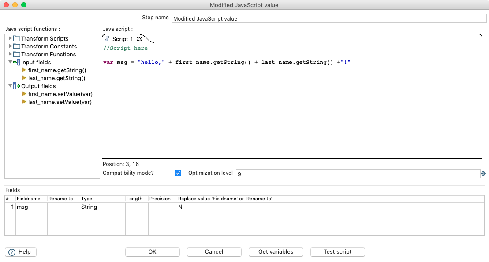

最后用hop将三个step链接，可以先执行preview看下结果

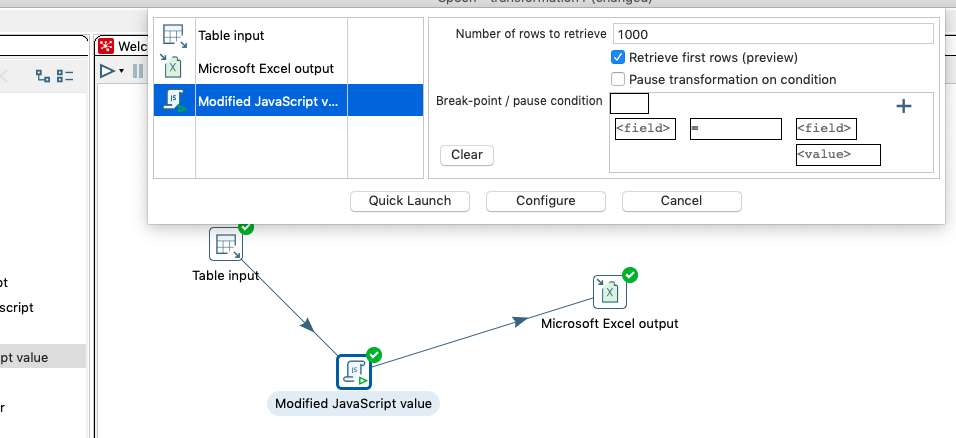

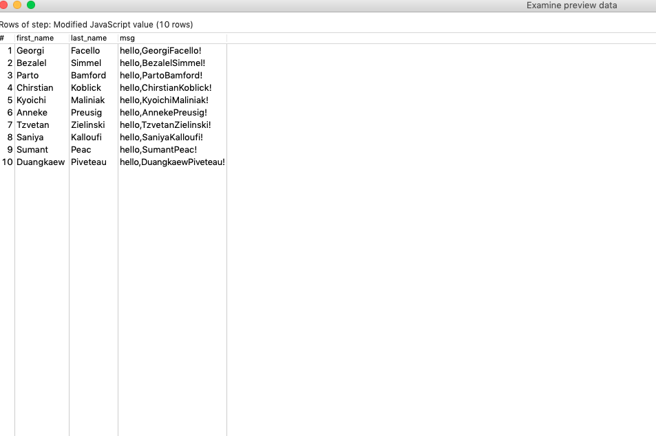

最后可以看下结果

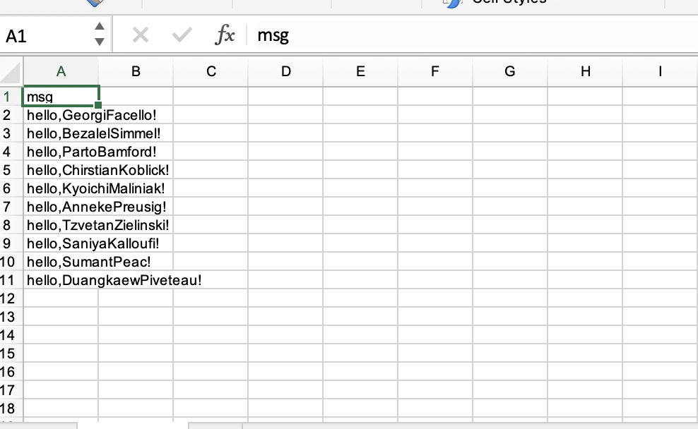

以上只是演示了数据转换中最基础的几个功能，其他更详细的功能都可以在Design tab中找到
总的来说 kettle的操作逻辑就是 steps + hops，step是你的操作步骤，hops就是链接。

## 作业 JOB

上面只介绍了kettle的核心功能之一转换，现在要介绍kettle的另一个功能job。

作业其实就是一个自动化流程，当你需要进行多个转换或者要增加一些逻辑控制条件的情况下，就需要job来实现。

这里就根据前面hello world的例子，实现一个简单的job，检测当文件夹内不存在file的时候，就自动从数据库中导出数据并添加hello。

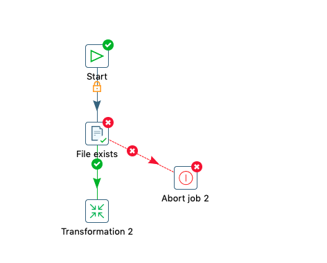

在右侧工具栏找到上图的控件拖进工作区，然后做hop连接，设置一下就行了。操作上和创建转换时类似的，只是将多个创建组合了起来

如下图是配置转换的界面，输入转换的脚本地址

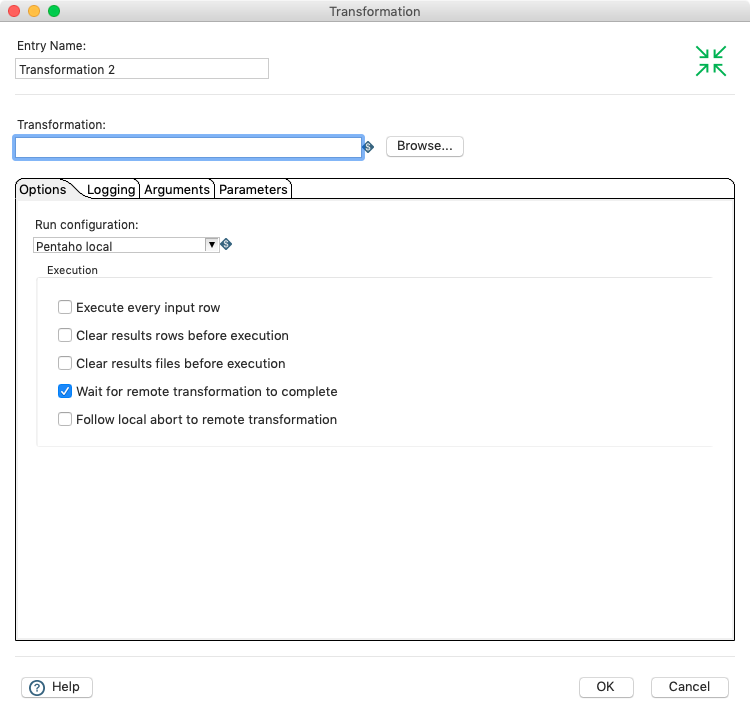


## 厨房与煎锅

kitchen和pan指令是用于执行作业和转换脚本的命令。

```zsh
./kitch.sh -file ./scripts/demo.kjb
./pan.sh -file ./scripts/demo.ktr
```

以后用spoon设计好的作业和转换只要保存下来，用命令行直接执行就好了，方便许多。

后期有用到新的功能就在更新笔记。

## 参考资料

[ETL利器Kettle实战应用解析系列一【Kettle使用介绍】](http://www.cnblogs.com/limengqiang/archive/2013/01/16/KettleApply1.html#syzj)

[KETTLE使用教程](https://blog.csdn.net/u012637358/article/details/82593492)

[kettle JOB使用](https://blog.csdn.net/neweastsun/article/details/38845795)

[kettle教程](https://ask.hellobi.com/blog/yuguiyang1990/category/1532)

[Kettle中文网](http://www.kettle.net.cn/)